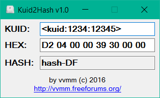

# Kuid2Hash

This app helps translate the numeric KUIDs to hexadecimals and also helps to identify the proper hash in the Trainz filesystem database.

[Download latest release here](bin/Debug/Kuid2Hash.exe)
